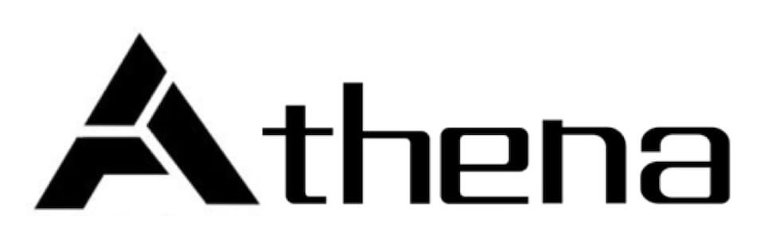

Athena2
===
[](http://nodejs.org)
[](https://www.npmjs.com/package/athena-html)
[](https://npmjs.com/package/athena-html)
[](https://raw.githubusercontent.com/o2team/athena/master/LICENSE)
[](https://github.com/o2team/athena/stargazers)

> O2Team构建项目流程工具，基于[Webpack3](https://webpack.js.org/)打包，提供多页、单页、H5三种模板选择，支持Nerv、React、Vue三大框架编译。
>
> 一次安装，到处运行



## 功能一览

### 创建项目

- [x] 生成项目、模块、页面、组件文件结构
- [x] 提供多页、单页、H5三大模板
- [x] 支持[Nerv](https://nerv.aotu.io/)、[React](https://reactjs.org/)、[Vue](https://vuejs.org/index.html) 热门前端框架

### 编译预览

- [x] 轻量组件化功能
- [x] Sass 编译
- [x] CSS合并压缩
- [x] CSS prefix，px转rem
- [x] JS合并压缩
- [x] 自动生成雪碧图，自动多倍图
- [x] 自动获取图片宽高
- [x] 文件内联，自定义图片转base64
- [x] 图片压缩
- [x] 字体压缩
- [x] 文件MD5戳
- [x] 本地预览

### 项目部署

- [x] 资源定位（图片等资源路径替换）
- [x] 生成CSS页面片
- [x] 部署到预览机和开发机

## 安装

基于``node``，请确保已具备较新的node环境（>=4.0.0），推荐使用node版本管理工具[nvm](https://github.com/creationix/nvm)，这样不仅可以很方便地切换node版本，而且全局安装时候也不用加sudo了。

### 安装本项目 **athena2**

```
$ [sudo] npm install -g athena2
```

由于国外源实在太慢，建议使用国内源来安装

```
$ [sudo] npm i -g athena2 --registry=http://registry.npm.taobao.org --disturl=http://npm.taobao.org/mirrors/node
```

目前已支持**sass**文件的编译


## 快速开始

基于命令 ``athena2``，同时提供了简写``ath2``

### 初始化

首先需要初始化Athena2，在这一步会有初始化工作目录、输入用户名等操作

```
$ ath2 init
```

### 生成新项目

#### 生成一个新的项目目录

```
$ ath2 a [项目名称]
```

同时提供了通过携带参数快速创建项目的命令

```
$ ath2 a --name test --description 测试 --sass --template complete --framework nerv
```

#### 快速生成H5应用目录
```
$ ath2 a --h5 [h5 template]
```

#### 参数说明
参数 `--name` 指定项目名称

参数 `--description` 指定项目描述

参数 `--template` 指定项目使用的模板，输入模板名称，支持complete（多页）、simple（单页）、h5（H5活动）三种应用模式。

参数 `--framework` 指定项目使用的框架，输入框架名称，支持Nerv、React、Vue三大框架。

参数 `--sass` 指定项目使用 `sass`

每个参数都是可缺省的。

然后根据提示一步一步来，将会自动生成项目的结构和所需文件代码

### 创建模块
*注：单页应用及H5无此功能*

#### 创建命令
```
$ ath2 m [模块名]
```
多页应用每个模块相当于一个页面

同时提供了通过携带参数快速创建模块的命令

```
$ ath2 m --name hhh --description 测试
```

#### 参数说明
参数 `--name` 指定模块名称

参数 `--description` 指定模块描述

每个参数都是可缺省的

然后根据提示一步一步来，将会自动生成项目的结构和所需文件代码

### 创建页面
*注：H5应用无此功能*
#### 创建命令
```
$ ath2 pa [页面名]
```
多页应用需**进入到该模块** 下，执行以上命令，单页应用直接在根目录下执行

同时提供了通过携带参数快速创建页面的命令

```
$ ath2 pa --name hello --description 测试
```

参数 `--name` 指定页面名称

参数 `--description` 指定页面描述

每个参数都是可缺省的

然后根据提示一步一步来，将会自动生成athena2的page目录和模板

### 创建组件

H5应用每个组件相当于一个js类

#### 创建命令
```
$ ath2 c [组件名]
```
多页应用需**进入到该模块** 下，执行以上命令，单页应用直接在根目录下执行

同时提供了通过携带参数快速创建组件的命令

```
$ ath2 c --name topbar --description 测试
```

#### 参数说明
参数 `--name` 指定组件名称

参数 `--description` 指定组件描述

每个参数都是可缺省的

然后根据提示一步一步来，将会自动生成athena2的component目录和模板

### 编译
```
// 编译所有模块
$ ath2 s
// 多页应用同时编译多个模块
$ ath2 s mod1 mod2
```
### 打包
```
// 打包所有模块
$ ath2 build
// 多页应用同时打包多个模块
$ ath2 build mod1 mod2
// H5支持打包生成zip压缩包
$ ath2 build --zip
```

## 自定义配置

### 基础配置
项目根目录下的config目录即配置文件目录，里面包含
- 公共配置文件：`index.js`
- 编译配置文件：`dev.js`
- 打包配置文件：`prod.js`
可根据需要自行配置相关参数，如publicPath、sourceRoot、outputRoot、port、host等。建议如无特殊情况，可不修改基础配置
### Webpack配置
如需添加Webpack其他配置，可在相应配置文件中添加`webpack`参数，填入相关配置

例如：添加`json-loader`

```
module.exports = {
  ...
  webpack: {
    module: {
      rules: [
        {
          test: /\.json$/,
          use: 'json-loader'
        }
      ]
    }
  }
}

```

### Postcss配置
Postcss相关配置可在相应配置文件的`module`>`postcss`中填入

#### 自动css前缀 autoprefixer
该功能默认开启，如不需要，配置`enable: false`

*更多配置参数详见：https://github.com/postcss/autoprefixer*

```
module.exports = {
  ...
  webpack: {},
  module: {
    postcss: {
      autoprefix: {
        enable: true,
        // 其他options
      }
    }
  }
}
```

#### REM转换
该功能H5应用默认开启

```
module.exports = {
  ...
  webpack: {},
  module: {
    postcss: {
      pxtorem: {
        enable: true,
        // 其他options
      }
    }
  }
}
```

*更多配置参数详见：https://github.com/ant-tool/postcss-plugin-px2rem*

#### 获取图片宽高 assets

该功能H5应用默认开启

自动获取1倍图宽高

    body {
      width: width('images/foobar.png'); /* 320px */
      height: height('images/foobar.png'); /* 240px */
      background-size: size('images/foobar.png'); /* 320px 240px */
    }

自动获取多倍图宽高

    body {
      width: width('images/foobar.png', 2); /* 160px */
      height: height('images/foobar.png', 2); /* 120px */
      background-size: size('images/foobar.png', 2); /* 160px 120px */
    }

```
module.exports = {
  ...
  webpack: {},
  module: {
    postcss: {
      assets: {
        enable: true,
        // 其他options
      }
    }
  }
}
```

*更多配置参数详见：https://github.com/assetsjs/postcss-assets*

#### 雪碧图 sprites

该功能H5应用默认开启，会将img/images目录下的按文件夹划分的所有图片合成一张雪碧图，例如

    /* Input */
    .comment { background: url(img/icon/ico-comment.png) no-repeat 0 0; }
    .bubble { background: url(img/icon/ico-bubble.png) no-repeat 0 0; }

    /* ---------------- */

    /* Output */
    .comment { background-image: url(img/sprite.icon.png); background-position: 0 0; }
    .bubble { background-image: url(img/sprite.icon.png); background-position: 0 -50px; }

**使用多倍图时需按文件夹划分图片，文件夹命名格式如：`name@2x`。使用了pxtorem功能无需按文件夹划分多倍图**

```
// prod.js
module.exports = {
  ...
  webpack: {},
  module: {
    postcss: {
      sprites: {
        enable: true,
        // 其他options
      }
    }
  }
}
```

*更多配置参数详见：https://github.com/2createStudio/postcss-sprites*


### 其他功能
#### dll配置
开放dll配置单独打包库文件，减少打包时间
```
// config/index.js
// 单个dll
library: {
  name: 'xxx', // 必填
  directory: 'xxx',
  libs: ['A', 'B']
}
// 多个dll
library: [{
  name: 'xxx', // 必填
  directory: 'xxx',
  libs: ['A', 'B']
},
{
  name: 'xxx', // 必填
  directory: 'xxx',
  libs: ['C', 'D']
}]
```
另外需要在模板html文件下插入dll的引用（也可以打包完成后手动插入）
```
// xxx.html
...
<body><body>
...
<% if (htmlWebpackPlugin.options.vendorFiles) {
  for (let i = 0; i < htmlWebpackPlugin.options.vendorFiles.length; ++i) { %>
    <script src="<%= htmlWebpackPlugin.options.vendorFiles[i] %>"></script>
<% }} %>
...
```
#### 图片压缩
图片压缩功能主要在打包时应用，H5应用默认开启该项功能
```
// prod.js
module.exports = {
  ...
  webpack: {},
  module: {
    imageMin: {
      enable: true,
      // 其他options
    }
  }
}
```

*更多配置参数详见：https://github.com/tcoopman/image-webpack-loader*

#### Base64 limit
该功能主要配置图片、文字转base64时的limit尺寸，默认为2000
```
module.exports = {
  ...
  webpack: {},
  module: {
    base64: {
      imageLimit: 8000,
      fontLimit: 000
    }
  }
}
```

## LICENCE

MIT License

Copyright (c) 2017 o2team

Permission is hereby granted, free of charge, to any person obtaining a copy
of this software and associated documentation files (the "Software"), to deal
in the Software without restriction, including without limitation the rights
to use, copy, modify, merge, publish, distribute, sublicense, and/or sell
copies of the Software, and to permit persons to whom the Software is
furnished to do so, subject to the following conditions:

The above copyright notice and this permission notice shall be included in all
copies or substantial portions of the Software.

THE SOFTWARE IS PROVIDED "AS IS", WITHOUT WARRANTY OF ANY KIND, EXPRESS OR
IMPLIED, INCLUDING BUT NOT LIMITED TO THE WARRANTIES OF MERCHANTABILITY,
FITNESS FOR A PARTICULAR PURPOSE AND NONINFRINGEMENT. IN NO EVENT SHALL THE
AUTHORS OR COPYRIGHT HOLDERS BE LIABLE FOR ANY CLAIM, DAMAGES OR OTHER
LIABILITY, WHETHER IN AN ACTION OF CONTRACT, TORT OR OTHERWISE, ARISING FROM,
OUT OF OR IN CONNECTION WITH THE SOFTWARE OR THE USE OR OTHER DEALINGS IN THE
SOFTWARE.
